# gcp-secure-deploy

Une petite API Python déployée sur Google Cloud Run, avec l'infrastructure écrite en Terraform et un pipeline GitHub Actions qui construit, scanne et déploie l'image à chaque push.

J'ai fait ce projet pour apprendre à monter une chaîne de déploiement complète sur GCP, en gardant la sécurité en tête dès le départ. Je suis en Mastère 2 Science Informatique et Numérique Expert en Informatique et Systèmes d'Information à l'EPSI et je cherche un stage ou Alternance DevOps / DevSecOps.

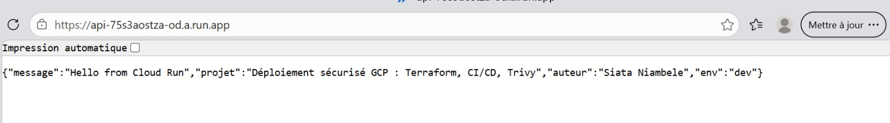

*L'API déployée sur Cloud Run renvoie le message JSON de la dernière version du code.*

## Ce que fait le projet

- Une API FastAPI avec deux routes : `/` (message JSON) et `/health` (utilisée pour la supervision).
- Une image Docker légère qui tourne avec un utilisateur non root.
- Toute l'infrastructure GCP décrite avec Terraform.
- Un pipeline CI/CD : build de l'image, scan Trivy, envoi dans Artifact Registry, déploiement sur Cloud Run.
- Une connexion GitHub vers GCP sans clé JSON.
- Un test de disponibilité avec alerte par e-mail.

## Architecture

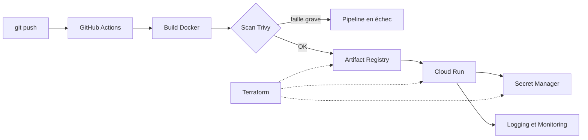

## Organisation du dépôt

```
app/main.py                    API FastAPI
Dockerfile
requirements.txt
terraform/main.tf              infrastructure GCP
terraform/.terraform.lock.hcl  version verrouillée du provider
.github/workflows/deploy.yml   pipeline CI/CD
```

## Infrastructure (Terraform)

Terraform crée les API nécessaires (Cloud Run, Artifact Registry, Secret Manager, IAM), le dépôt d'images, un compte de service dédié à l'API, un secret, le droit de lecture de ce secret pour ce compte uniquement, le service Cloud Run et son accès public.

```bash
cd terraform
terraform init
terraform plan
terraform apply
```
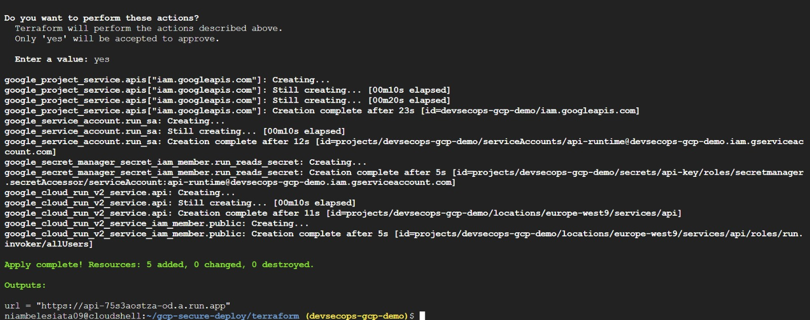
*Fin du `terraform apply` dans Cloud Shell. C'est la seconde exécution : la première s'était arrêtée parce que l'API IAM n'était pas activée.*


Deux détails qui m'ont servi : j'ai ajouté des `depends_on` pour que les API soient activées avant les ressources qui en dépendent, et un `ignore_changes` sur l'image du service, puisque c'est le pipeline qui la met à jour et pas Terraform.

L'état Terraform et `terraform.tfvars` sont exclus du dépôt par le `.gitignore`.

## Pipeline CI/CD

À chaque push sur `main` (sauf si seuls le README ou le dossier `terraform` changent), le workflow :

1. s'authentifie auprès de GCP avec Workload Identity Federation ;
2. construit l'image et l'étiquette avec le SHA du commit ;
3. la scanne avec Trivy, et s'arrête si une faille HIGH ou CRITICAL corrigeable est trouvée ;
4. envoie l'image dans Artifact Registry ;
5. déploie une nouvelle révision sur Cloud Run.

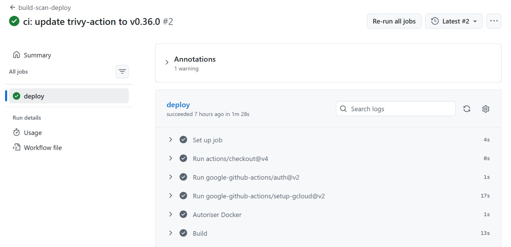
*Le job `deploy` du pipeline réussit en 1 min 28 s, après la correction de la version de Trivy.*


Chaque déploiement crée une nouvelle révision. Les anciennes restent disponibles, donc on peut revenir en arrière rapidement.

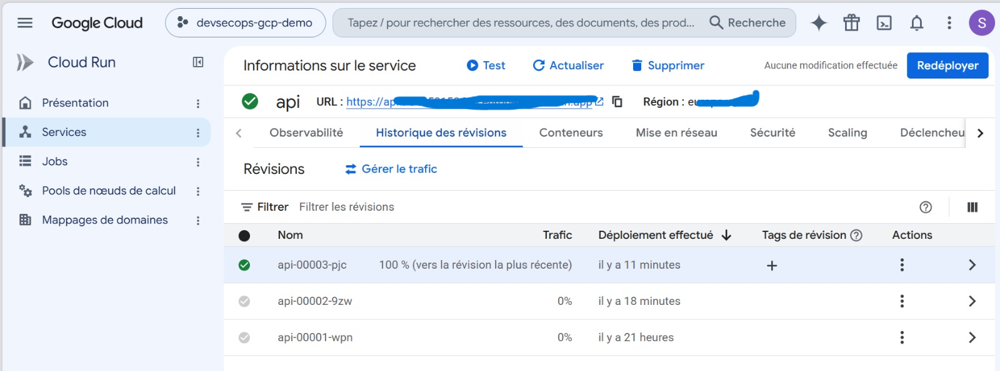
*Historique des révisions : la 00001 a été créée par Terraform, les 00002 et 00003 par le pipeline. La plus récente reçoit tout le trafic.*

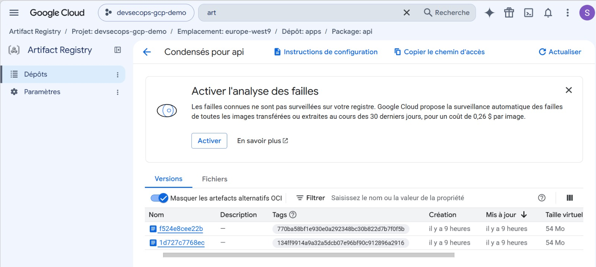
*Les images du dépôt `apps`. Chaque tag est le SHA du commit qui l'a produite (`770ba58` et `134ff99`).*


Le workflow a besoin de trois secrets GitHub : `WIF_PROVIDER`, `DEPLOY_SA` et `GCP_PROJECT`.

## Sécurité

- **Pas de clé JSON** : GitHub se connecte à GCP par Workload Identity Federation, avec un accès temporaire limité à ce dépôt.
- **Droits limités** : le compte `github-deployer` peut seulement pousser des images, déployer sur Cloud Run et utiliser le compte d'exécution.
- **Compte d'exécution dédié** : `api-runtime` n'a aucun rôle au niveau du projet et ne lit qu'un seul secret.
- **Secrets** : la clé de l'API est dans Secret Manager et injectée au démarrage, pas dans le code de l'application.
- **Image** : base `python:3.12-slim`, utilisateur non root, scan Trivy avant publication.

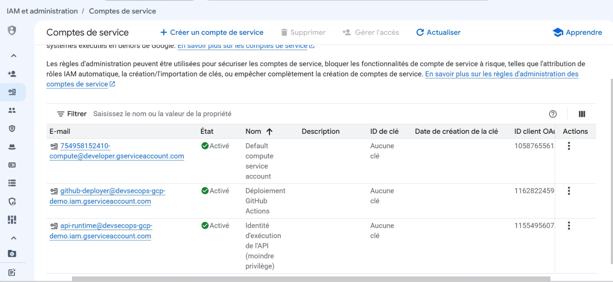
*Les deux comptes de service créés pour le projet, `github-deployer` et `api-runtime`, n'ont aucune clé.*


## Supervision

Un test de disponibilité appelle `/health` toutes les minutes depuis plusieurs régions. Si la route ne répond plus en 200, une alerte part par e-mail. Les journaux sont consultables dans Cloud Logging.

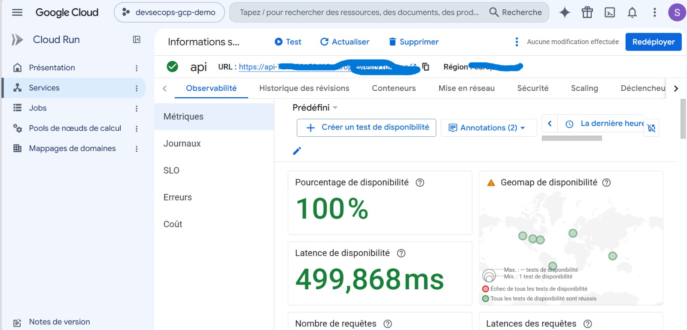
*Disponibilité de l'API sur la dernière heure : 100 %, avec des vérifications réussies depuis plusieurs régions.*


## Coûts

Cloud Run ne facture qu'à l'usage, donc le coût est quasi nul au repos. J'ai mis un budget mensuel de 5 € avec alertes à 50 %, 90 % et 100 %. Quand je ne m'en sers plus, `terraform destroy` supprime tout.


*Budget mensuel avec des alertes à 50 %, 90 % et 100 %.*


## Ce qui m'a bloquée

- **`terraform apply` en erreur 403** sur le compte de service : l'API IAM n'était pas activée. Je l'ai ajoutée à la liste des API, avec un `depends_on`.
- **Pipeline en échec dès le démarrage** : la version `0.28.0` de l'action Trivy n'existait plus. Les mainteneurs ont changé le format des tags (préfixe `v`) à la suite d'un incident de sécurité sur ce projet. Je suis passée à `v0.36.0`.
- **Push de l'image refusé** : un des secrets GitHub (`DEPLOY_SA`) contenait une mauvaise valeur.
- **Test de disponibilité en 404** : j'avais mis le nom d'hôte dans le champ du chemin. Je l'ai vu en regardant les journaux de Cloud Run, puis j'ai recréé le test depuis la page du service. Cette panne a d'ailleurs déclenché une alerte e-mail, ce qui m'a permis de vérifier que la notification fonctionne.

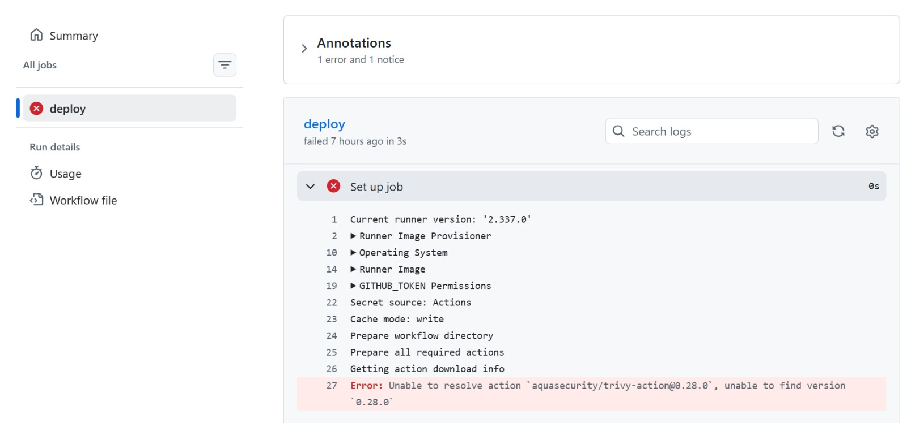
*Premier lancement du pipeline : GitHub ne trouve plus la version 0.28.0 de l'action Trivy.*

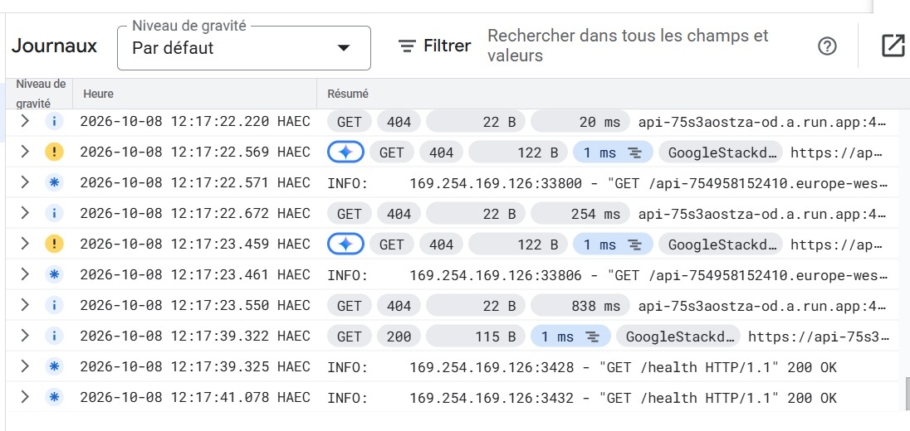
*Journaux Cloud Run : les erreurs 404 du test mal configuré, puis les réponses 200 sur `/health`.*

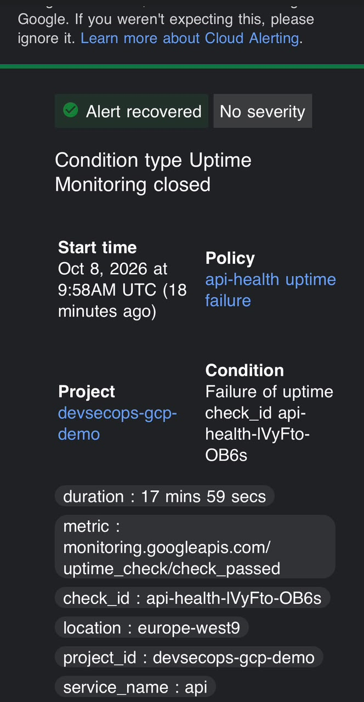
*E-mail de résolution d'une alerte. Elle était restée ouverte environ 18 minutes à cause d'un test de disponibilité mal configuré, puis s'est fermée après sa suppression.*


## Limites et pistes d'amélioration

- La valeur du secret est écrite dans le code Terraform pour la démonstration. Il faudrait la créer en dehors de Git.
- L'état Terraform est stocké en local dans Cloud Shell. Un backend distant (bucket Cloud Storage) serait plus propre.
- Le service est public (`allUsers`) et il n'y a pas de VPC dédié.
- Le compte de service par défaut de Compute Engine garde le rôle Éditeur du projet. Je ne l'ai pas modifié.
- Les actions GitHub sont référencées par tag. Les épingler sur l'empreinte du commit serait plus sûr.
- Pas encore de tests automatisés ni d'environnements dev/prod. Une version sur GKE est aussi prévue.

## Reproduire le projet

1. Créer un projet GCP et un budget d'alerte.
2. Dans Cloud Shell, installer Terraform, puis lancer `terraform init` et `terraform apply` dans `terraform/` avec la variable `project_id`.
3. Configurer Workload Identity Federation pour le dépôt et créer les trois secrets GitHub.
4. Pousser sur `main` : le pipeline déploie l'API.

---

Siata Niambele
